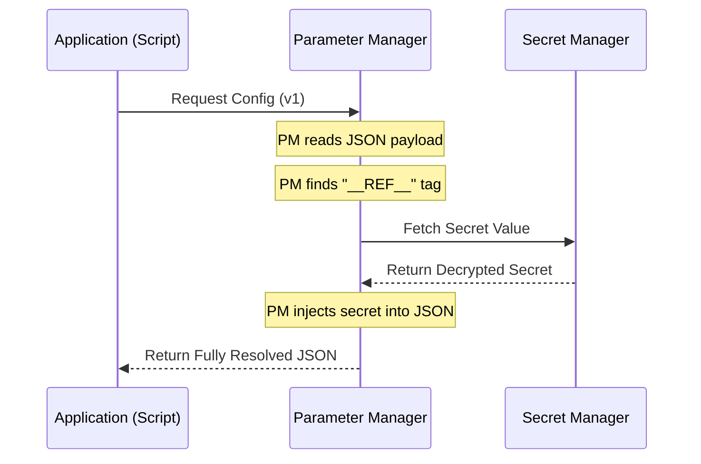

# Google Cloud Parameter Manager Demo (Bash Edition)

This repository contains a "Zero-to-Hero" Bash script to automate the infrastructure setup and usage of Google Cloud Parameter Manager.

It demonstrates how to centrally manage application configuration (JSON) while securely referencing sensitive data stored in Secret Manager, resolving everything at runtime with a single CLI command.

**Reference:** This demo implements the concepts discussed in the official Google Cloud Blog:  
[A Practical Guide to Google Cloud's Parameter Manager](https://cloud.google.com/blog/products/devops-sre/google-cloud-parameter-manager)

---

## 🧠 Concepts: The "House" Metaphor

To understand why you should use Parameter Manager instead of just Secret Manager, visualize your infrastructure like a House:

### 1. Parameter Manager (The Blueprint) 📝
**"The Centralized Configuration Store"**

- **Role:** Stores metadata, feature flags, and settings that determine how the house is built and behaves.
- **Format:** Structured data (JSON, YAML).
- **The Superpower:** It supports Secret References. You can store a standard JSON configuration file that contains pointers (`__REF__`) to secrets.

### 2. Secret Manager (The Safe) 🔐
**"The Vault"**

- **Role:** Stores the diamonds and cash (API Keys, Database Passwords, Certificates).
- **Format:** Binary or text blobs. It enforces strict access control.
- **Usage:** Strictly for sensitive data. Storing simple settings like `font_size: 12` here is expensive and functionally overkill.

### 3. Cloud KMS (The Locksmith) 🔑
**"The Cryptographic Root"**

- **Role:** Creates and manages the cryptographic keys used to lock the Safe.
- **Usage:** You rarely interact with KMS directly; Secret Manager uses it behind the scenes.

---

## ⚡ Feature Comparison

| Feature | Parameter Manager | Secret Manager | Cloud KMS |
|---------|-------------------|----------------|-----------|
| **Primary Use Case** | App Configuration | Passwords & Credentials | Encryption Keys |
| **Data Visibility** | Visible to Developers | Strictly Restricted | N/A (Keys never leave) |
| **Data Format** | Typed (JSON, YAML) | Blob / Text | N/A |
| **Cost** | Optimized for reads | Per-access cost | Based on Key Ops |
| **Example** | `{"theme": "dark"}` | `AIzaSyD...` | `cryptoKeys/key-1` |

---

## 🔄 The Workflow

In this demo, Parameter Manager acts as the "Front Door" for your application's configuration.



1. The App asks Parameter Manager for the configuration.
2. Parameter Manager detects a special tag: `__REF__(.../secrets/weather-api-key)`.
3. Parameter Manager (using its own Service Identity) calls Secret Manager to unlock that specific secret.
4. Parameter Manager stitches the secret into the JSON and returns the complete configuration.

---

## 🛠️ Prerequisites

- **Google Cloud Project:** An active project with billing enabled.
- **Google Cloud SDK (gcloud):** Installed and authenticated.
  > **Note:** Ensure your SDK is updated: `gcloud components update`
- **jq:** Required for parsing the JSON output in the script.
  - Linux: `sudo apt-get install jq`
  - Mac: `brew install jq`

---

## 🚀 Installation & Usage

### 1. Download the Script

Create a file named `gpm-gcloud-demo.sh` and paste the code below.

<details>
<summary><strong>Click to expand source code (gpm-gcloud-demo.sh)</strong></summary>

```bash
#!/bin/bash

# Stop on error
set -e

# --- CONFIGURATION ---
# Define gcloud command
GCLOUD="gcloud"

# Get Project details
PROJECT_ID=$($GCLOUD config get-value project)
PROJECT_NUMBER=$($GCLOUD projects describe $PROJECT_ID --format="value(projectNumber)")
REGION="us-central1"
SECRET_ID="weather-api-key"
PARAM_ID="json-weather-config"

echo "========================================================"
echo "🌤️  GOOGLE CLOUD PARAMETER MANAGER: GCLOUD EDITION"
echo "    Project: $PROJECT_ID"
echo "    Region:  $REGION"
echo "========================================================"

# 1. ENABLE APIS
echo -e "\n[1/7] 🛠️  Enabling APIs..."
$GCLOUD services enable \
    secretmanager.googleapis.com \
    parametermanager.googleapis.com \
    --quiet

# 2. CLEANUP (Ensure fresh start)
echo -e "\n[2/7] 🧹 Cleaning up old resources..."
$GCLOUD beta parameter-manager parameters delete $PARAM_ID --location=$REGION --quiet 2>/dev/null || true

# 3. CREATE SECRET
echo -e "\n[3/7] 🔐 Creating/Updating Secret..."
# Create secret if it doesn't exist
if ! $GCLOUD secrets describe $SECRET_ID --quiet >/dev/null 2>&1; then
    $GCLOUD secrets create $SECRET_ID --replication-policy="automatic" --quiet
fi
# Add a new version (the actual key)
printf "my-super-secret-weather-key-123" | $GCLOUD secrets versions add $SECRET_ID --data-file=- --quiet >/dev/null
echo "    -> Secret ready."

# 4. PREPARE PAYLOAD
echo -e "\n[4/7] 📦 Preparing JSON Payload..."
# We use the special __REF__ syntax to point to the 'latest' version of the secret
cat <<EOF > payload.json
{
  "version": "v1",
  "environment": "production",
  "apiKey": "__REF__(//secretmanager.googleapis.com/projects/${PROJECT_NUMBER}/secrets/${SECRET_ID}/versions/latest)",
  "settings": {
    "defaultLocation": "London",
    "units": "metric",
    "retries": 3
  }
}
EOF

# 5. CREATE PARAMETER & VERSION
echo -e "\n[5/7] ☁️  Creating Parameter Resource..."

# A. Create the Parameter (The Container)
$GCLOUD beta parameter-manager parameters create $PARAM_ID \
    --location=$REGION \
    --format="JSON" \
    --quiet

# B. Create the Version (The Data)
echo "    -> Pushing Version v1..."
$GCLOUD beta parameter-manager versions create $PARAM_ID \
    --location=$REGION \
    --version-id="v1" \
    --payload-file="payload.json" \
    --quiet

# 6. IAM PERMISSIONS (Crucial Step)
echo -e "\n[6/7] 👮 Granting Permissions to Service Agent..."
# We need the email of the Google-managed robot that acts on behalf of Parameter Manager
SERVICE_AGENT=$($GCLOUD beta services identity create --service=parametermanager.googleapis.com --project=$PROJECT_ID --format="value(email)")

echo "    -> Identity: $SERVICE_AGENT"
echo "    -> Granting 'Secret Accessor' role..."
$GCLOUD secrets add-iam-policy-binding $SECRET_ID \
    --member="serviceAccount:$SERVICE_AGENT" \
    --role="roles/secretmanager.secretAccessor" \
    --condition=None --quiet > /dev/null

# 7. VERIFY (Render)
echo -e "\n[7/7] 🚀 Verifying configuration..."
echo "    -> Fetching and Rendering..."

RENDERED_JSON=$($GCLOUD beta parameter-manager versions render $PARAM_ID \
    --location=$REGION \
    --version-id="v1" \
    --format="value(renderedPayload)")

# Parse the result with jq
API_KEY=$(echo "$RENDERED_JSON" | jq -r '.apiKey')
ENV=$(echo "$RENDERED_JSON" | jq -r '.environment')

echo -e "\n📊 RESULTS:"
echo "   Environment: $ENV"

if [[ "$API_KEY" == *"__REF__"* ]]; then
    echo -e "   🔑 API Key:   ❌ FAILED (Still shows reference string)"
    echo "      (IAM propagation might need a few more seconds. Run the render command again.)"
else
    echo -e "   🔑 API Key:   ✅ $API_KEY" 
fi

rm payload.json
echo "========================================================"
```

</details>

### 2. Authenticate

Ensure you are logged in to the correct Google Cloud project:

```bash
gcloud auth login
gcloud config set project YOUR_PROJECT_ID
```

### 3. Run the Demo

Make the script executable and run it:

```bash
chmod +x gpm-gcloud-demo.sh
./gpm-gcloud-demo.sh
```

---

## 🔍 Deep Dive: What the Script Does

The script automates the following Infrastructure as Code steps:

1. **Enable APIs:** Activates `secretmanager` and `parametermanager`.
2. **Create Secret:** Stores a dummy API key (`my-super-secret-weather-key-123`) in Secret Manager.
3. **Create Payload:** Generates a JSON file containing app settings and the special reference string:
   ```json
   "apiKey": "__REF__(//secretmanager.googleapis.com/projects/.../secrets/weather-api-key/versions/latest)"
   ```
4. **Create Parameter:** Uploads the JSON payload to Parameter Manager.
5. **Configure IAM:** *(Crucial Step)* It fetches the unique Service Identity email for Parameter Manager and grants it the `roles/secretmanager.secretAccessor` permission. Without this, Parameter Manager cannot "unlock the safe."
6. **Render:** It simulates an application startup by calling the `render` command. This proves that Parameter Manager successfully retrieved the secret and injected it into the JSON response.

---

## 📝 License

This project is provided as-is for educational purposes.
